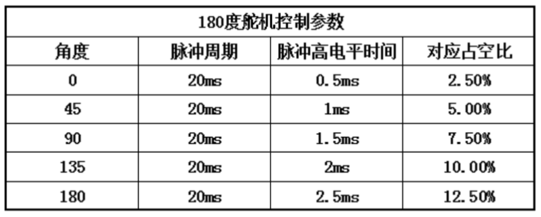
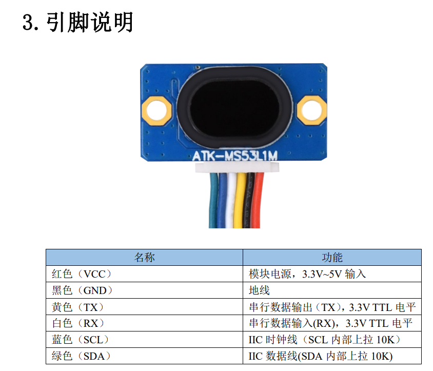
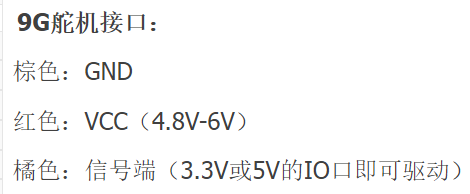
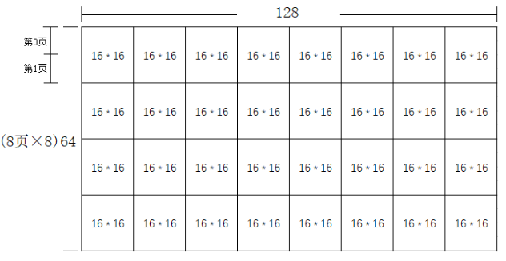

# 认识实习项目

*我知道我把所有的 `radar` 都拼成了 `ladar` ，不用再提醒我了*

## 题目：基于 STM32 的简易激光雷达

* [演示视频(B站)](https://www.bilibili.com/video/BV1BP4y1o7L3)  
<!-- * [未完成报告(.doc格式)](./report/2020级自动化认识实习-朱思源.doc)   -->

## 功能

<!-- * 能够扫描前方 `180°` 范围内的物体
* 将扫描结果以图像的形式显示在屏幕上 -->
* 控制舵机进行周期性 `180°` 旋转
* 将激光测距器搭载在舵机上，对左右 `90°` 的物体进行测距
* 将`测距结果`结合测距时发送给舵机的 `PWM 波占空比`（换算成`角度`）保存在单片机内部
* 将结果发送给一台 1.3 寸 `OLED 显示器`，以图像的形式展示扫描结果
* 连接红外模块，可用红外遥控器进行遥控

## 所用电子模块型号

* [单片机核心板 STM32F401CCU6 ￥19.5](https://item.taobao.com/item.htm?spm=a230r.1.14.1.414c49b9PCIWEk&id=673430906769&ns=1&abbucket=9&mt=)
* [舵机 ￥5.8](https://detail.tmall.com/item.htm?spm=a230r.1.14.51.598e7ffcO4JutW&id=628478684024&ns=1&abbucket=9)
* [激光测距模块（4米版本） ￥68.0](https://detail.tmall.com/item.htm?spm=a230r.1.14.16.2c593ce618qCLg&id=651558248343&ns=1&abbucket=9&skuId=4879795303518)
* [OLED显示屏1.3寸 ￥21.5](https://item.taobao.com/item.htm?spm=a230r.1.14.16.77a652684Hiazm&id=562145367495&ns=1&abbucket=9#detail)

## 大致成本

19.5 + 5.8 + 68.0 + 21.5 = 114.8 元

## 引脚分配

* USART1-**PA9**(TX)、**PA10**(RX)：接测距模块**RX**、**TX**
* USART2-**PA2**(TX)、**PA3**(RX)：接红外模块**RX**、**TX**，注意VCC需连5V
* IIC1-**PB6**(SCL)、**PB7**(SDA)：接OLED的**SCL**、**SDA**
* TIM10CH1-**PB8**(PWM)：接舵机的**信号线**

## 遥控器设置

* 串口设置：波特率9600，数据位8，校验位None，停止位One
* 重置：按“0”，00 FF 19
* 停止：按“*”，00 FF 16
* 继续：按“#”，00 FF 0D

## 参考资料

  
  

